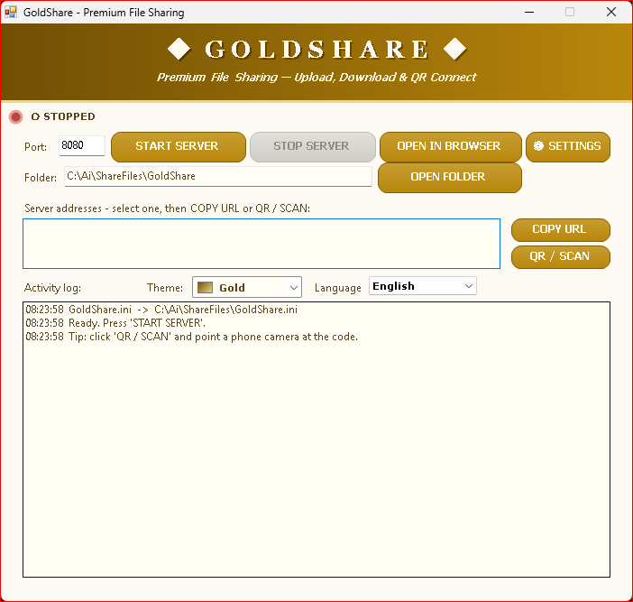
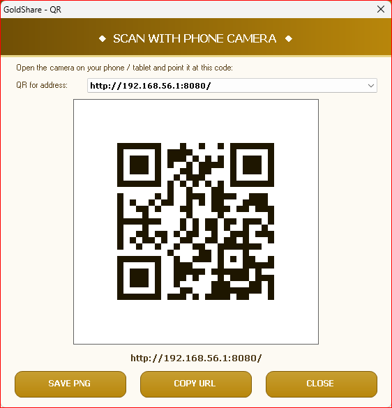

# GoldShare

> ShareIt-style file sharing server that turns any Windows PC into a beautiful, QR-powered download hub — no install, no dependencies, no fluff.


<!-- size badge placeholder -->

---

## What is it?

GoldShare is a **premium local file sharing server** in the spirit of ShareIt. Launch it on one machine and anyone on your LAN (or office Wi-Fi) can browse, preview, and download your shared folders straight from their phone browser — complete with a gorgeous themed web UI, per-file QR codes, ZIP downloads, and camera uploads.

Everything lives in a **single `.cs` file**, compiles with the raw `csc.exe` compiler that ships with `C:\WINDOWS\Microsoft.NET\Framework`, and supports **Windows XP** right up to modern Windows. No NuGet, no installer, no garbage.

Two flavors are shipped:

| Edition | Purpose |
| --- | --- |
| **GoldShare** | Full-featured server: everything below, maximum comfort. |
| **GoldShareSuperLite** | RAM-frugal edition that idles under ~10 MB working set — built for XP-era low-RAM boxes. |

---

## Features

### The ShareIt experience
| | |
| --- | --- |
| 📱 Browser guest UI | Your phone, tablet, or any PC — zero apps to install |
| 🆚 Auto QR engine | Point your phone camera at the screen, starts sharing instantly |
| 🗜 ZIP download | Grab a whole folder in one tap |
| 🖼 Thumbnails | Image previews rendered live in the browser |
| 📶 Resumable downloads | Large files survive flaky Wi-Fi |
| 📷 Camera upload | Push photos straight from your phone to the PC |
| 🔎 Search / sort / grid | Find files fast, browse however you like |

### Security & control
| | |
| --- | --- |
| 🔑 Login PIN | Lock the hub so only authorised people see files |
| 🗑 Delete PIN | Who can delete — and a separate code to do it |
| ⏱ Auto-refresh | Directory listing stays live without reloading |
| 📝 Notes → clipboard | Copy short texts between devices in one tap |
| 🌐 Traffic monitor | Live upload/download activity view |
| ✂️ Per-file QR / copy | Share any single file by QR or copied link |

### The extra polish
| | |
| --- | --- |
| 🎨 **8 themes** | `gold · sea · nature · fruits · space · fire · moon · midnight` — themes drive both the desktop GUI *and* the hosted HTML |
| 🌍 **7 languages** | English · Français · العربية · Español · Deutsch · Türkçe · Русский |
| 🔧 Settings dialog | Port, speed limit, fonts, appearance, and more |
| 💾 Persistent `GoldShare.ini` | Remembers your preferences |
| 🚀 Auto-start & single instance | One running server, always ready |
| 🖥 System tray | Minimizes out of the way |
| 📋 Log file | Keep an audit trail |
| ✅ Auto-updates | Force `requireAdministrator` via app manifest for system-wide binds |

---

## Screenshots

| | |
| --- | --- |
|  |  |
| Main window — themed GUI with live QR code | Guest web UI served to phones & browsers |

---

## Quick start

### 1. Get a build

Run `build.cmd` (or compile the two editions yourself):

```bat
C:\WINDOWS\Microsoft.NET\Framework\v2.0.50727\csc.exe /target:winexe /optimize+ /win32icon:icon.ico /out:GoldShare.exe GoldShare.cs
C:\WINDOWS\Microsoft.NET\Framework\v2.0.50727\csc.exe /target:winexe /optimize+ /win32icon:icon.ico /out:GoldShareSuperLite.exe GoldShareSuperLite.cs
```

> The `icon.ico` embeds your beautiful app icon straight into both executables.

### 2. Launch & share

```
GoldShare.exe            # full edition
GoldShareSuperLite.exe   # RAM-frugal edition
```

1. Pick your shared folder.
2. Look at the big QR code on screen.
3. Point your phone's camera at it.
4. Done — you're sharing.

Check the header badge on the window or the settings dialog for the exact URL and port (`default: 8080`).

---

## Building from source

| File | Output |
| --- | --- |
| `GoldShare.cs` | `GoldShare.exe` (full edition) |
| `GoldShareSuperLite.cs` | `GoldShareSuperLite.exe` (RAM-frugal edition) |
| `icon.ico` | Embeds the application icon into both executables |

No project files, no package manager, no build tools beyond the .NET Framework's bundled compiler — that's the entire toolchain. Open `build.cmd` and hit enter.

---

## Requirements

- **OS:** Windows XP SP2 or newer (2000/2003/7/8/10/11 …)
- **Runtime:** .NET Framework 2.0 (preinstalled on Windows XP+ for years)
- **Chip:** any x86/x64 — SuperLite sips RAM on old boxes

---

## How it works

- Single-file C# GUI (`winforms`), an embedded HTTP server, and a generated mobile-first web UI.
- Palettes are defined once and reused for **both** the desktop theme *and* the HTML/CSS served to browsers — change the theme, the guest page follows.
- Config is a human-editable `GoldShare.ini` next to the exe.
- `GoldShareSuperLite` adds:
  - **Lazy localization** — only the chosen language ever loads.
  - **Reusable IO buffers** — zero per-request `byte[]` churn.
  - **Idle RAM governor** — force-collects and trims the working set when the server goes quiet.

---

## Project layout

```
ShareFiles/
├── build.cmd               # one-click build: both executables
├── icon.ico                # application icon (embedded into exes)
├── icon-full.png           # full-size source artwork
├── app.manifest            # admin elevation manifest (SuperLite)
├── GoldShare.cs            # full edition — single file, ~3200 lines
├── GoldShareSuperLite.cs   # RAM-frugal edition — single file
└── old-scripts/            # full version history (beta → final)
```

---

## License

MIT — free to use, fork, and reshape into anything you like.

---

*Made for the LAN, the office, the dorm, and the 2006-era laptop that never dies.*